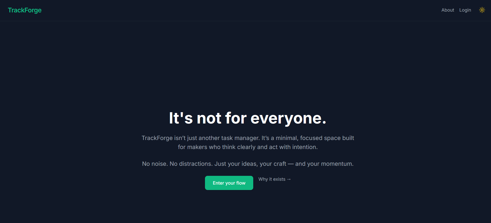
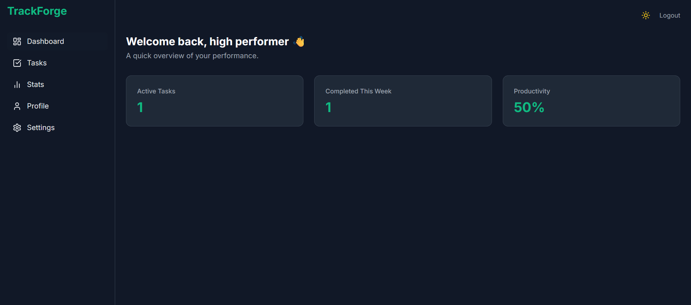
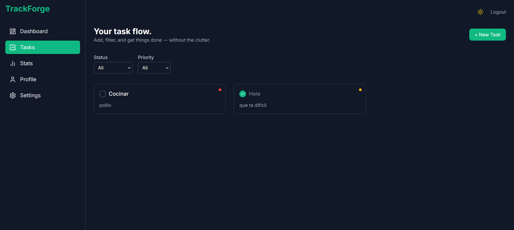

# TrackForge — Minimal Task Manager for Makers

> _No friction. No noise. Just focus, flow — and your next task._

---

## 🧭 About TrackForge

**TrackForge** isn’t just another task manager — it’s a **focused productivity environment** designed for makers who move with intent.

Built from scratch to be minimal, fast, and deeply intentional, it offers:
- ✍️ Task management with filters, priorities, and inline editing
- 🎯 UI settings for density, theme, and motion preferences — persisted locally
- 🔐 Passwordless login via magic link (Supabase Auth)
- 📈 Visual stats to track weekly momentum
- 🧪 CI-integrated E2E testing for reliability and flow

---

## 🚀 Live Preview

👉 [https://trackforge.quimromero.com](https://trackforge.quimromero.com)

---

## ✨ Features

- ✅ Add, edit, delete, complete, and filter tasks
- 🎛️ Switch between **comfortable** and **compact** layout density
- 🌗 Light/dark mode with system preference detection
- 🌀 Toggle animations for users who prefer reduced motion
- 📬 Passwordless authentication (magic link via email)
- 📊 Chart-based stats of tasks completed during the week
- 📱 Fully responsive and mobile-ready
- 🧪 Automated end-to-end tests (Cypress + GitHub Actions)

---

## 🧠 Tech Stack

| Tech                     | Role                              |
|--------------------------|-----------------------------------|
| **React + TypeScript**   | Core frontend framework           |
| **Zustand**              | Global state management           |
| **Supabase**             | Auth + database backend           |
| **Framer Motion**        | Animations and layout transitions |
| **Tailwind CSS**         | Design system and theming         |
| **React Hook Form + Zod**| Forms and validation              |
| **Chart.js**             | Task completion statistics        |
| **Vite**                 | Build tool and dev server         |
| **Cypress**              | E2E testing                       |
| **GitHub Actions**       | Continuous integration            |

---

## 🗂 Project Structure

- `src/`
  - `auth/` – Supabase session management
  - `components/` – UI components (modals, cards, layout)
  - `hooks/` – Reusable logic (tasks, auth)
  - `pages/` – Views like Dashboard, Tasks, Profile
  - `routes/` – Route protection and layout shells
  - `store/` – Zustand slices (theme, user, settings)
  - `styles/` – Tailwind config and tweaks
  - `types/` – Shared TypeScript types
- `cypress/` – E2E test specs and config
- `public/` – Meta tags, icons, favicon

---

## 🧪 End-to-End Testing

TrackForge includes local **end-to-end tests** powered by [Cypress](https://www.cypress.io/).  
Core flows like task management, UI preferences, and authentication are covered and verified.

Currently tested:
- ✅ Home page headline rendering
- ✅ Task creation, completion, filtering, editing, deletion
- ✅ UI settings: theme toggle, animation toggle, layout density

> 🧰 Tests run locally via `npm run test` or `npm run test:ui`.

**Note:** CI integration (e.g. GitHub Actions) is planned and will be added soon.

---

## 📸 Screenshots

| Home | Dashboard | Tasks |
|------|-----------|--------|
|  |  |  |

---

## 🧩 Notes

- 🧠 100% hand-coded — no UI libraries or templates
- 🧼 Prioritizes **clarity and control** over visual clutter
- ⚡ Built for speed, responsiveness, and accessibility
- 🛠 Built as a **developer portfolio project**, not a production SaaS

---

## 📬 Contact

If you're looking for a frontend developer who builds **clean, purposeful, performant** interfaces:

- 📧 quim@quimromero.com  
- 🌐 [https://quimromero.com](https://quimromero.com)

---

> _TrackForge is a quiet rebellion against noisy software —  
> built for makers who value clarity over chaos._
