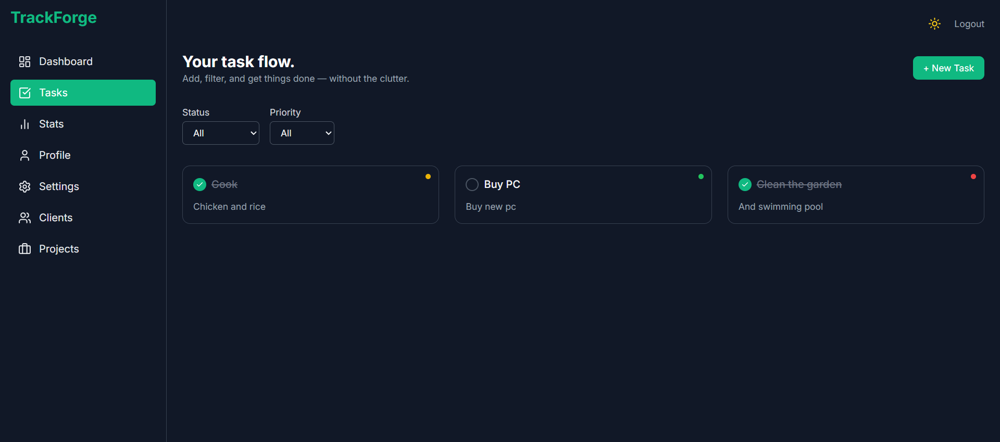

# TrackForge — Minimal Task Manager for Makers


> _No friction. No noise. Just focus, flow — and your next task._

---

## 🧭 About TrackForge

**TrackForge** is a **focused productivity environment** — a quiet alternative to noisy task managers, built for makers who value clarity over chaos.

Minimal, fast, and intentional, it provides:

- ✍️ Task management with filters, priorities, inline editing
- 🎯 Customizable UI density, theme, and motion preferences (persisted locally)
- 🔐 Passwordless login via Supabase (magic link) + guest/demo mode
- 👥 Business mode for **clients & projects** management with Kanban workflow
- 📈 Visual stats for weekly momentum and productivity tracking
- 🧪 Automated E2E testing integrated with CI for reliability

---

## 🚀 Live Preview

👉 https://trackforge.quimromero.com

---

## ✨ Features

- ✅ Add, edit, delete, complete, and filter tasks
- 🔎 Filter by **status** (active, completed) and **priority** (low, medium, high)
- 🗂️ Manage **Clients** & **Projects** in business mode (with Kanban drag & drop)
- 🎛️ Toggle between **comfortable** and **compact** layouts
- 🌗 Light/dark theme with system preference detection
- 🌀 Reduced motion mode for accessible, distraction-free use
- 📬 Passwordless authentication (magic link) or **guest login**
- 📊 Weekly stats dashboard with completion charts
- 📱 Fully responsive, mobile-first design
- ♿ Accessibility checks baked into CI (cypress-axe)
- 🧪 E2E tests (Cypress + GitHub Actions) for critical flows

---

## 🧠 Tech Stack

| Tech                           | Role                                |
| ------------------------------ | ----------------------------------- |
| **React + TypeScript**         | Core frontend framework             |
| **React Router v7**            | Routing and navigation              |
| **Zustand**                    | State management (persisted slices) |
| **Supabase**                   | Auth + Postgres database            |
| **Framer Motion**              | UI animations and transitions       |
| **Tailwind CSS**               | Styling and theming                 |
| **Lucide React**               | Icon system                         |
| **React Hook Form + Zod**      | Forms and validation                |
| **Chart.js + react-chartjs-2** | Weekly task completion stats        |
| **Day.js**                     | Date handling                       |
| **Vite**                       | Dev server + build tool             |
| **Cypress**                    | End-to-end testing                  |
| **GitHub Actions**             | CI/CD pipeline                      |
| **Lighthouse CI**              | Performance audits                  |

---

## 🗂 Project Structure

- `src/`
  - `auth/` – Supabase integration, session, and mock client
  - `components/` – UI (cards, modals, sidebar, layout)
  - `hooks/` – Business logic (tasks, projects, auth)
  - `pages/` – Views (Dashboard, Tasks, Stats, Clients, Projects, etc.)
  - `routes/` – Public/private routes with protection
  - `store/` – Zustand slices (user, theme, settings, tasks, business data)
  - `types/` – Shared TypeScript types (Task, Client, Project)
  - `styles/` – Tailwind setup and overrides
- `cypress/` – Test specs, helpers, a11y checks
- `public/` – Static assets (icons, meta, manifest, illustrations)

---

## 🧪 End-to-End Testing

TrackForge uses **Cypress** for smoke tests, accessibility checks, and core flows, running automatically on **every PR and push to `main`**.

**Currently tested**

- ✅ Guest login → create task → view in list
- ✅ Task lifecycle: create, update, complete, delete
- ✅ Filters: status + priority
- ✅ UI preferences: theme, density, animations
- ✅ Home page & accessibility checks

**Planned coverage**

- 🖱️ Rich modal interactions
- 🧭 Client/project Kanban actions
- 🔐 Full Supabase magic link auth flow
- 📊 Dashboard and stats updates after actions

👉 CI status: https://github.com/quim-romero/trackforge/actions

---

## ♿ Accessibility & ⚡ Performance

**Accessibility**

- Automated via **cypress-axe**
- CI fails on **critical** violations

**Performance**

- Audited via **Lighthouse CI** (LHCI)
- Goal: keep **FCP/LCP in green** on key views

Run locally:

```bash
# Accessibility checks
npm run test:a11y

# Cypress (interactive)
npm run test:e2e:open

# Lighthouse report
npm run build && npm run lh:report
```

Reports are saved under `./lhci/`.

---

## 📸 Screenshots

| Home                            | Dashboard                                 | Tasks                             |
| ------------------------------- | ----------------------------------------- | --------------------------------- |
|  |  |  |

---

## 🧩 Notes

- 💡 Supports **guest/demo mode** (offline, seeded data)
- 🧠 100% hand-coded UI (no component libraries)
- 🧼 Designed for **clarity and control**
- ⚡ Optimized for speed, responsiveness, accessibility
- 🛠 Built as a **developer portfolio project**, not a production SaaS

---

## 📬 Contact

If you're looking for a frontend engineer who builds **clean, purposeful, performant** apps:

- 📧 quim@quimromero.com
- 🌐 https://quimromero.com

---

> _TrackForge is a quiet rebellion against noisy software — built for makers who move with intent._
