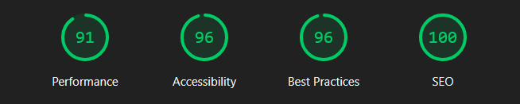
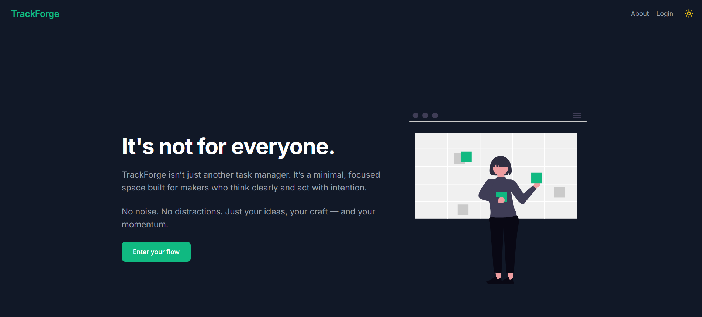
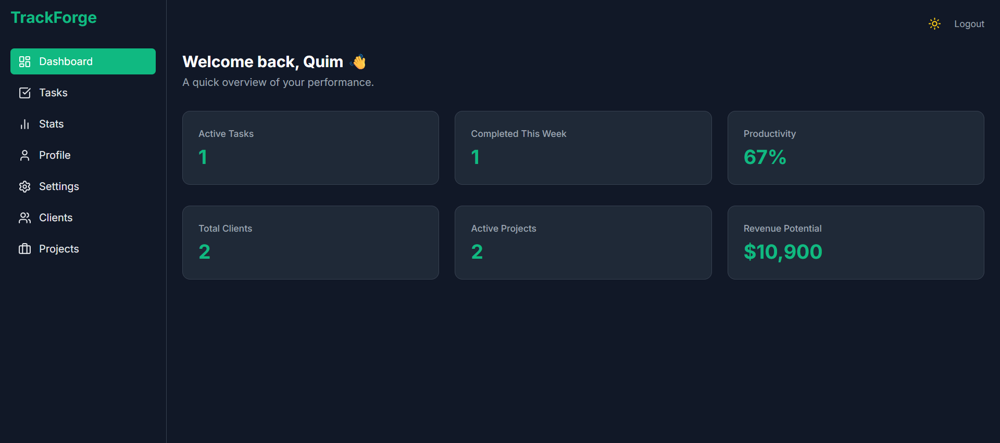

# TrackForge — Minimal Task Manager for Makers

> _No friction. No noise. Just focus, flow — and your next task._

---

## 🧭 About TrackForge

**TrackForge** isn’t just another task manager — it’s a **focused productivity environment** designed for makers who move with intent.

Built from scratch to be minimal, fast, and deeply intentional, it offers:

- ✍️ Task management with filters, priorities, and inline editing
- 🎯 UI settings for density, theme, and motion preferences — persisted locally
- 🔐 Passwordless login via magic link (Supabase Auth)
- 📈 Visual stats to track weekly momentum
- 🧪 CI-integrated E2E testing for reliability and flow

---

## 🚀 Live Preview

👉 [https://trackforge.quimromero.com](https://trackforge.quimromero.com)

---

## ✨ Features

- ✅ Add, edit, delete, complete, and filter tasks
- 🎛️ Switch between **comfortable** and **compact** layout density
- 🌗 Light/dark mode with system preference detection
- 🌀 Toggle animations for users who prefer reduced motion
- 📬 Passwordless authentication (magic link via email)
- 📊 Chart-based stats of tasks completed during the week
- 📱 Fully responsive and mobile-ready
- 🧪 Automated end-to-end tests (Cypress + GitHub Actions)

---

## 🧠 Tech Stack

| Tech                      | Role                              |
| ------------------------- | --------------------------------- |
| **React + TypeScript**    | Core frontend framework           |
| **Zustand**               | Global state management           |
| **Supabase**              | Auth + database backend           |
| **Framer Motion**         | Animations and layout transitions |
| **Tailwind CSS**          | Design system and theming         |
| **React Hook Form + Zod** | Forms and validation              |
| **Chart.js**              | Task completion statistics        |
| **Vite**                  | Build tool and dev server         |
| **Cypress**               | E2E testing                       |
| **GitHub Actions**        | Continuous integration            |

---

## 🗂 Project Structure

- `src/`
  - `auth/` – Supabase session management
  - `components/` – UI components (modals, cards, layout)
  - `hooks/` – Reusable logic (tasks, auth)
  - `pages/` – Views like Dashboard, Tasks, Profile
  - `routes/` – Route protection and layout shells
  - `store/` – Zustand slices (theme, user, settings)
  - `styles/` – Tailwind config and tweaks
  - `types/` – Shared TypeScript types
- `cypress/` – E2E test specs and config
- `public/` – Meta tags, icons, favicon

---

## 🧪 End-to-End Testing

TrackForge uses **Cypress** for reliable E2E testing, with each PR and every push to `main` triggering checks via **GitHub Actions**.

Currently tested:

- ✅ Home page headline renders
- ✅ Task creation, completion, filtering, editing, deletion
- ✅ UI settings: theme toggle, animation toggle, layout density

Coming soon:

- 🖱️ Modal interactions and task quick actions
- 🧭 Filtering by status and priority (edge cases)
- ⚙️ Theme, animations, and density persistence across sessions
- 🔐 Passwordless login (Supabase magic link) end-to-end
- 📊 Weekly stats chart updates after completing tasks
- ♿️ Accessibility audits

🧪 [View CI status →](https://github.com/quim-romero/trackforge/actions)

---

## ♿ Accessibility & ⚡ Performance

- **Accessibility:** automatic checks with `cypress-axe` (CI fails on **critical** violations).
- **Performance:** Lighthouse (LHCI) runs against the production build.
  _Goal: keep FCP/LCP in the green on the homepage._

> Generate locally with: `npm run build && npm run lh:report`  
> Reports are saved to `./lhci/`.

---

## 📸 Screenshots

| Home                            | Dashboard                                 | Tasks                             |
| ------------------------------- | ----------------------------------------- | --------------------------------- |
|  |  |  |

---

## 🧩 Notes

- 🧠 100% hand-coded — no UI libraries or templates
- 🧼 Prioritizes **clarity and control** over visual clutter
- ⚡ Built for speed, responsiveness, and accessibility
- 🛠 Built as a **developer portfolio project**, not a production SaaS

---

## 📬 Contact

If you're looking for a frontend developer who builds **clean, purposeful, performant** interfaces:

- 📧 quim@quimromero.com
- 🌐 [https://quimromero.com](https://quimromero.com)

---

> _TrackForge is a quiet rebellion against noisy software —  
> built for makers who value clarity over chaos._
